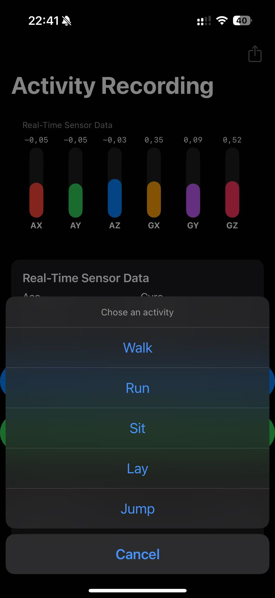
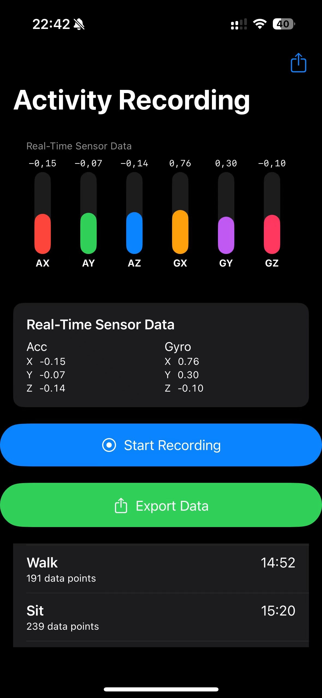
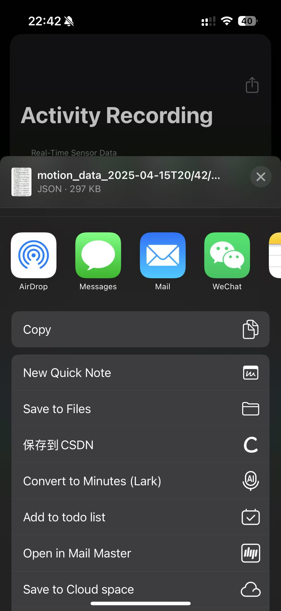

# 📱 Human Activity Recorder App

An iOS-based application for **real-time human activity data recording**, supporting sensor data collection, manual labeling, and data export. Perfect for building **Human Activity Recognition (HAR)** datasets and training machine learning models.

---

## 🧩 Features

### ✅ Real-Time Sensor Data Recording

The app collects motion data from iPhone's built-in sensors (accelerometer and gyroscope) in real-time and displays them as live charts.

> Collected data includes:
- `acc_x`, `acc_y`, `acc_z` (Acceleration)
- `gyro_x`, `gyro_y`, `gyro_z` (Rotation rate)
- `timestamp`
- `label`

---

### 🏷️ Manual Activity Labeling

Users can manually assign labels during recording (e.g., "walking", "running", "climbing stairs"). The label is automatically attached to the data for easier training and analysis.

---

### 🎬 Easy Start & Stop Recording

Simple and intuitive UI with clear buttons to start and stop recording activities.

---

### 📊 Real-Time Sensor Chart

While recording, the app displays a dynamic chart of sensor data for quick visual feedback.

---

### 📤 Export & Share Data

Export your recording in **JSON** or **CSV** format and share via AirDrop, Mail, WeChat, etc.

> Example file name:
    motion_data_2025-04-15T20:42:12.json

---

## 📦 Tech Stack

- Swift / SwiftUI
- CoreMotion (sensor access)
- Combine (data binding)
- Codable (JSON encoding)
- FileManager (data saving)

---

## 🧠 TODO (Planned Improvements)

- [ ] Support multiple labels and switching during recording
- [ ] Export format selection (JSON / CSV)
- [ ] More detailed charts for extra data dimensions
- [ ] Real-time activity prediction using CoreML

---

## 📸 App UI Overview

| Label Selection | Sensor Data & Export |
| --------------- | --------------------- |
|  |  |

---

## 👨‍💻 Author

[🔗 GitHub - @TWWinde](https://github.com/TWWinde)

If you find this project helpful, feel free to give it a ⭐️ star!